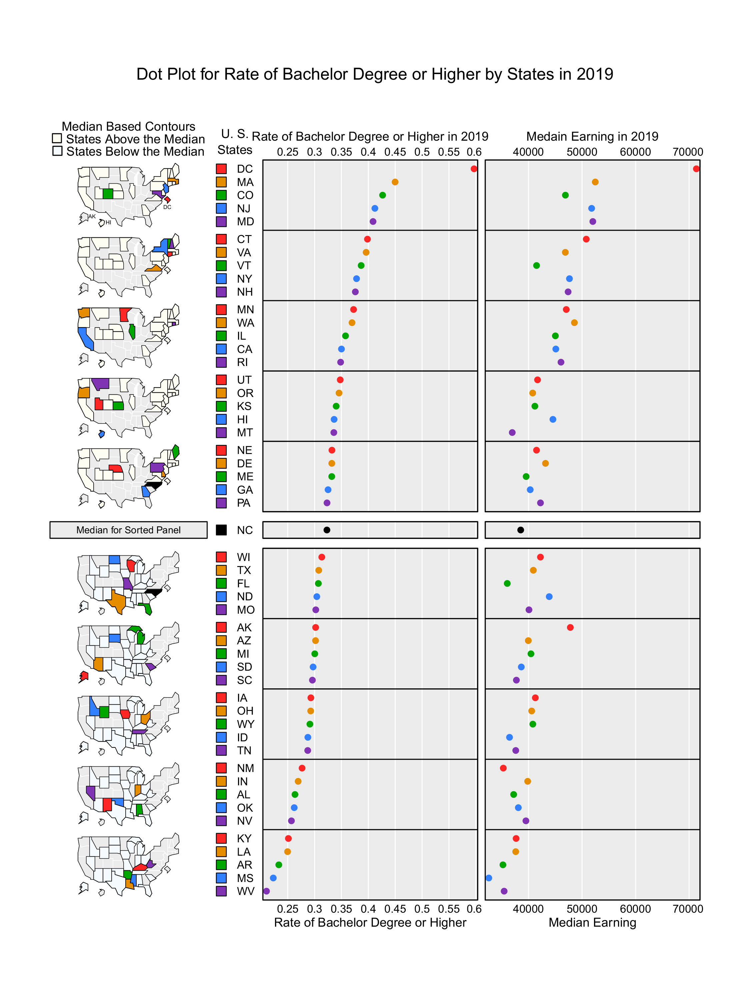

# Results
```{r}
library(ggplot2)
library(gridExtra)
library(vcd)
library(ggmosaic)
library(usdata)
library(micromapST)
```

```{r}
edu2019 <- education[education$Year==2019,]
edu2019 %>%
  group_by(Gender) %>%
  mutate(total_pop = sum(Estimate))%>%
  ungroup()%>%
  ggplot()+
  geom_col(aes(x = Education,y=Estimate/total_pop, fill = Gender), position="dodge" )+
  scale_fill_brewer(palette = 3)+ 
  xlab("Year in School") +
  ylab("Proportion")+
  ggtitle("Grouped Bar Chart of Education Attainment in 2019 Differed by Gender") + 
  theme_light()
```
```{r}
#mosaic plot : done
#x education y gender
dt <- xtabs(Estimate ~ Education + Gender, data=edu2019)
vcd::mosaic(dt, direction = c("v", "h"), labeling = labeling_border(rot_labels = c(45, 0), abbreviate_labs = c(2, 1)),)
```


```{r}
#科学计数法: done 
race_total <- race[race$Gender=="Total",]
ylab <- c(0, 50, 100, 150)
ggplot(race_total)+
  geom_col(aes(x=Race,y=Estimate,fill=Education),position ="dodge")+
  xlab("Race")+
  ylab("Population")+
  ggtitle("Group Bar Chart of 2019 Education Attainment by Race")+
  scale_y_continuous(labels = paste0(ylab, "M"),
                     breaks = 10^6 * ylab
  )+
  scale_fill_brewer(palette = 1) + 
  theme(axis.text.x = element_text(angle=20, vjust=0.5))

```
```{r}
# Function to change counts to cases
# Source: http://www.cookbook-r.com/Manipulating_data/Converting_between_data_frames_and_contingency_tables/
countsToCases <- function(x, countcol = "Estimate") {
  idx <- rep.int(seq_len(nrow(x)), x[[countcol]])
  x[[countcol]] <- NULL
  x[idx, ]
}
```


```{r}
race_gender <- race[race$Gender !="Total",]
#mosaic plot: x = race, y = gender, facet by education

#Two ways: use vcd mosaic plot (could not facet)
# use ggplot, but it needs data frame type instead of contingency table (take long time)
# exceeds time limit
race_gender <- race_gender[race_gender$Education != "Total",]
#race_gender_df <- countsToCases(race_gender, countcol = "Estimate")
#ggplot(race_gender_df) + 
#  geom_mosaic(x = product(Race, Gender)) + 
#  facet_grid(Education~.)
```


```{r}
#男女比例
#check value
ggplot(race_gender) +
  geom_col(aes(x = fct_rev(Race),y=Estimate, fill = Gender), position = "fill") + 
  xlab("Race") +
  theme(legend.position = "bottom") +
  coord_flip()+
  guides(fill = guide_legend(reverse = TRUE)) +
  facet_wrap(~Education, ncol = 1) +
  ylab("proportion") +
  scale_fill_brewer(palette = "RdGy") + 
  ggtitle("Proportional breakdown of Gender for each race, faceted on Education Attainment")

```


```{r}
#add legend！！！
earning2019 <- earning[earning$Year==2019,]
earning_total<- earning2019$Earning[earning2019$Education=="Total"]
earning2019 <- earning2019[earning2019$Education!= "Total",]
#earning2019%>%
#  group_by(Education)%>%
#  mutate(total_earn =earning_total )%>%
#  ungroup()%>%
#  ggplot()+
#  geom_col(aes(x=Education,y=Earning))+
#  geom_hline(aes(yintercept=total_earn),col="red")+
#  coord_flip()+
#  facet_wrap(~Gender, ncol = 1) +
#  ggtitle("Median Earning in 2019 based on Education Attainment and Gender")

#earning_plot + facet_grid(rows = vars(Gender))
```


```{r}
#change birth csv file
#title
#check value
ggplot(birth) +
  geom_col(aes(x = as.factor(Marriage), y = Estimate, fill = fct_rev(Education)), position = "fill")+
  coord_flip() +
  theme_light(15)+
  theme(legend.position = "bottom") +
  guides(fill = guide_legend(reverse = TRUE)) +
  scale_fill_brewer(palette = "RdBu")+
  theme(legend.title = element_text(size = 7),legend.text = element_text(size=7))+
  facet_wrap(~Give_birth, ncol = 1)+
  ylab("proportion") +
  xlab("Marriage Status")+
  ggtitle("2019 Proportional breakdown of education attainment on \n marriage status,faceted on giving birth or not")


```

```{r}
#one title 
#y label too small
new_states<-states %>%
  group_by(State)%>%
  mutate(bachelor_higher = (Population[Education=="Bachelor Degree"]+Population[Education=="Advanced Degree"])/Population[Education == "Total"])%>%
  mutate(abb = state2abbr(State))%>%
  mutate(median_earning = Earning[Education=="Total"])%>%
  ungroup()

new_states$abb[is.na(new_states$abb)]="PR"

ba_rate<-ggplot(new_states)+
  geom_point(aes(x=bachelor_higher, y=reorder(abb, bachelor_higher)), color = "blue") + 
  xlab("Rate of Bachelor Degree or Higher")+
  ylab("State")+
  ggtitle("2019 Rate of Bachelor Degree or Higher for Each State")+
  theme_light()

earnings <- 
  ggplot(new_states)+
  geom_point(aes(x=median_earning, y=reorder(abb,bachelor_higher)), color = "red") +
  xlab("Median Earning of the State")+
  ylab("State")+
  ggtitle("2019 Median Earning for Each State")+
  theme_light()


grid.arrange(ba_rate, earnings, ncol=2)

  
```

```{r}
new_states<-states %>%
  group_by(State)%>%
  mutate(bachelor_higher = (Population[Education=="Bachelor Degree"]+Population[Education=="Advanced Degree"])/Population[Education == "Total"])%>%
  mutate(abb = state2abbr(State))%>%
  mutate(median_earning = Earning[Education=="Total"])%>%
  ungroup()

statesDFrame<-na.omit(new_states)

rate <- unique(statesDFrame$bachelor_higher)
earning <- unique(statesDFrame$median_earning)
statesDF<- data.frame(cbind(rate,earning))

row.names(statesDF) <- unique(statesDFrame$abb)
```


```{r}
statesDF
```


```{r}
panelDesc <- data.frame(                 
    type=c("mapmedian","id","dot","dot"),  
    lab1=c("","","Rate of Bachelor Degree or Higher in 2019","Medain Earning in 2019"),   
    lab3=c("","","Rate of Bachelor Degree or Higher","Median Earning"), 
    col1=c(NA,NA,1,2)               
    )
ExTitle <- c( "Dot Plot for Rate of Bachelor Degree or Higher by States in 2019")
#quartz(width=7.5, height = 10, dpi = 72, pointsize = 10)
pdf(file="EX4-Scatter-Dots.pdf",width=7.5,height=10)
micromapST(statesDF,panelDesc,sortVar=1,ascend=FALSE,title=ExTitle)  
```

```{r,include=TRUE, out.width = "100%", fig.cap=c("your caption"), echo=FALSE}

```


